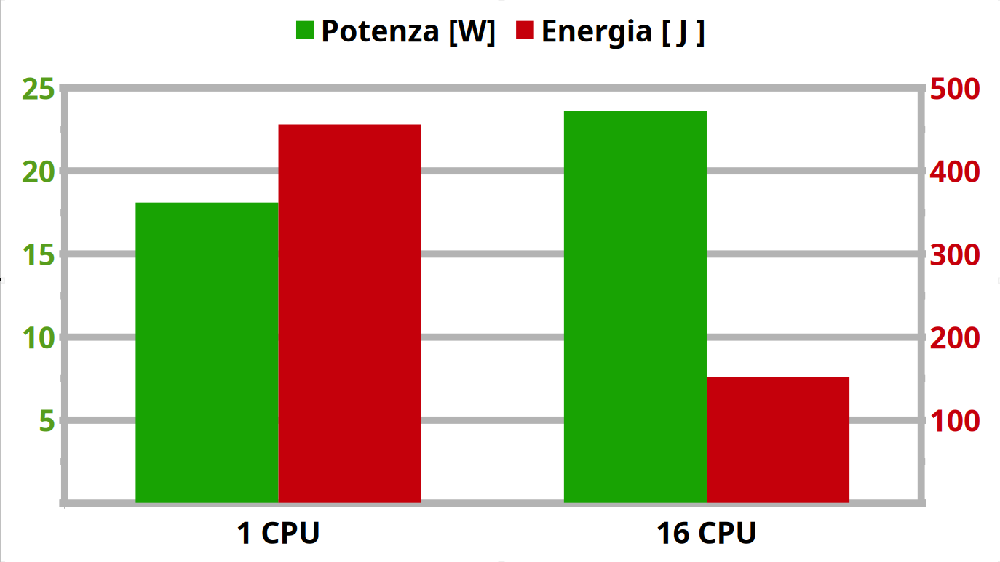

# Green Computing from the CLI
## Measuring Energy Consumption on Linux 🔋🐧

### Andrea Manzini
#### Software Quality Engineer @ SUSE


---
# About Me

- Veteran Unix Admin / BOFH background
- QA Engineer [@SUSE](https://www.suse.com)
- Open Source Contributor
- OpenSUSE Package Maintainer
- 🌍 Passionate about efficiency and sustainability


---
# Why Energy Efficiency?

*It's not just "being green"*

- **Mobile & IoT:** Battery life is a competitive advantage.
- **Data Centers:**

   Small savings $\times$ thousands of servers = Millions of € and tons of $CO_2$.
- **Performance:** High energy = Heat = *Thermal Throttling*.
- **The "Cloud" Gap:** "If I can't touch the hardware, how do I measure it?"

<!--
Question: "How many Joules does your last 'git push' cost?"
Thermal Throttling: Hot code is slow code.
-->

---
## Basics math: Power vs. Energy

### Power [Watt]:
The *rate* at which energy is consumed.
*Analogy: Car speed (90 km/h).*

### Energy [Joule]:
The *total* amount used over time.

**Energy = Power × Time**

*Analogy: Distance traveled (200 km).*

**Our Goal:**
Minimize the total Joules for a specific task.


---
# The Hardware Magic: Intel RAPL

**Running Average Power Limit**

Modern CPUs (Intel/AMD) don't have physical "meters" inside, but they have very accurate **Power Models**.

- **Domains:**
    - **PKG:** Entire CPU socket.
    - **CORE:** Computation cores.
    - **DRAM:** Memory controller & RAM.
- **Accuracy:** Not a "truth" but a highly precise estimation based on hardware counters, voltage, and temperature.

---
# The Linux Interface: powercap

Linux exposes RAPL data via the `powercap` framework in the virtual filesystem:

`/sys/class/powercap/intel-rapl/`

```python
# A "quick and dirty" measurement script
def read_energy():
  with open("/sys/class/powercap/intel-rapl:0/energy_uj", "r") as f:
    return int(f.read())    

v0 = read_energy()
time.sleep(1)
v1 = read_energy()
print(f"Average Power: {(v1-v0)/1e6:.1f} W")
```

---
# The CLI Toolbox

| Tool | Best For... | Command |
| :--- | :--- | :--- |
| **powertop** | System-wide diagnosis & "vampire" processes. | `sudo powertop` |
| **powerstat** | Real-time monitoring of system drain. | `sudo powerstat` |
| **perf** | **Precision surgical measurement** of a command. | `sudo perf stat -e power/energy-pkg/` |
| **s-tui** | Visualizing stress vs. power vs. frequency. | `s-tui` |

---
# Experiment 1: sort a 1GB text file

let's create a 1GB text file

```
$ tr -dc 'A-Za-z0-9 ' < /dev/urandom | fold -w 80 | head -c 1G > big.txt
$ wc -l big.txt
13256071 big.txt

$ sort big.txt > /dev/null
```
Takes ~25 seconds. 

---
We could sort using parallelism, but Parallel sorting uses more cores (more Watts). Will it also consume more Energy (Joules)?

```
$ time sort --parallel=16 big.txt > /dev/null
```
Takes ~6.4 seconds.

---
Measure 1: sort single-thread

```
$SORT_CMD1=sort --parallel=1 big.txt > /dev/null
sudo perf stat -e power/energy-pkg/ -- $SORT_CMD1
```

Measure 2: sort multi-thread
```
$SORT_CMD16=sort --parallel=16 big.txt > /dev/null
sudo perf stat -e power/energy-pkg/ -- $SORT_CMD16
```

---
## Experiment results

- **Single-threaded:** 25s @ ~18W = **455 Joules**
- **16 Threads:** 6.4s @ ~24W = **151 Joules**

### Result: ~66% Energy Saving!
**Lesson:** Finishing fast and letting the CPU return to "Idle" (C-states) is often the best strategy.



---
# Experiment 2: Calculate the 1,000,000th prime number.

| Language | Time | Energy (J) |
| :--- | :--- | :--- |
| **Python** 🐍 | 50.2 s | 934 J |
| **Rust** 🦀 | 2.1 s | 39 J |

**For this CPU-bound task, Rust is 23x more energy-efficient.**

*Note: We used the exact same algorithm for both.*


---
# Beyond Local: The cloud native challenge

**The Problem:** In AWS/GCP, the hypervisor hides RAPL. `/sys/class/powercap` is empty!

### a solution: Kepler (Kubernetes-based Efficient Power Level Exporter)
- Uses **eBPF** to watch CPU instructions, cache misses, and context switches.
- Uses **Machine Learning** to "guess" power consumption per Pod/Container.
- **Goal:** "Joules per Request" in your Grafana dashboard.

---
# The Modern Stack: Scaphandre

A specialized metrology agent written in **Rust**.

- **Bridge:** Connects low-level metrics (RAPL, NVIDIA) to Prometheus.
- **Embodied Carbon:** Can estimate the energy it took to *manufacture* the server, not just run it.
- **Transparency:** Makes energy a "first-class citizen" alongside CPU and RAM metrics.


---
# Standards & Action

### OpenTelemetry (OTel)
Energy is being standardized! OTel Semantic Conventions mean your standard APM (Datadog, Jaeger) will soon show Energy by default.

### Carbon Aware SDK (Green Software Foundation)
- **Spatial Shifting:** Run the job in the region with the cleanest grid (e.g., Sweden vs. Poland).
- **Temporal Shifting:** Wait 3 hours to run the batch job when the wind is blowing.

---
# Limitations & Best Practices

- **What's missing?** RAPL doesn't (usually) measure GPUs, Disks, or Network cards.
- **Repeatability:** Close your browser/Slack before measuring! Establish a **baseline**.
- **Model vs. Truth:** It's an estimation, but it's consistent for comparison.
- **Don't Over-optimize:** Sometimes the energy to *refactor* the code is more than the energy saved in 10 years of execution.

---
# Summary & Takeaways

1. **Efficiency = Quality:** Green code is often just *good* code.
2. **Measure, Don't Guess:** Use `perf stat` for surgical benchmarks.
3. **Race to Sleep:** Optimization usually beats under-clocking.
4. **Cloud is Possible:** Tools like **Kepler** are bringing transparency to shared hardware.
5. **Standardize:** Look into **OpenTelemetry** for long-term monitoring.

---
# Thanks for your attention!

## Andrea Manzini
### https://ilmanzo.github.io
### Mastodon/GitHub: `@ilmanzo`

**Questions?**
- *Does it work on ARM?*
- *GPU measurements?*
- *CI/CD integration?*


