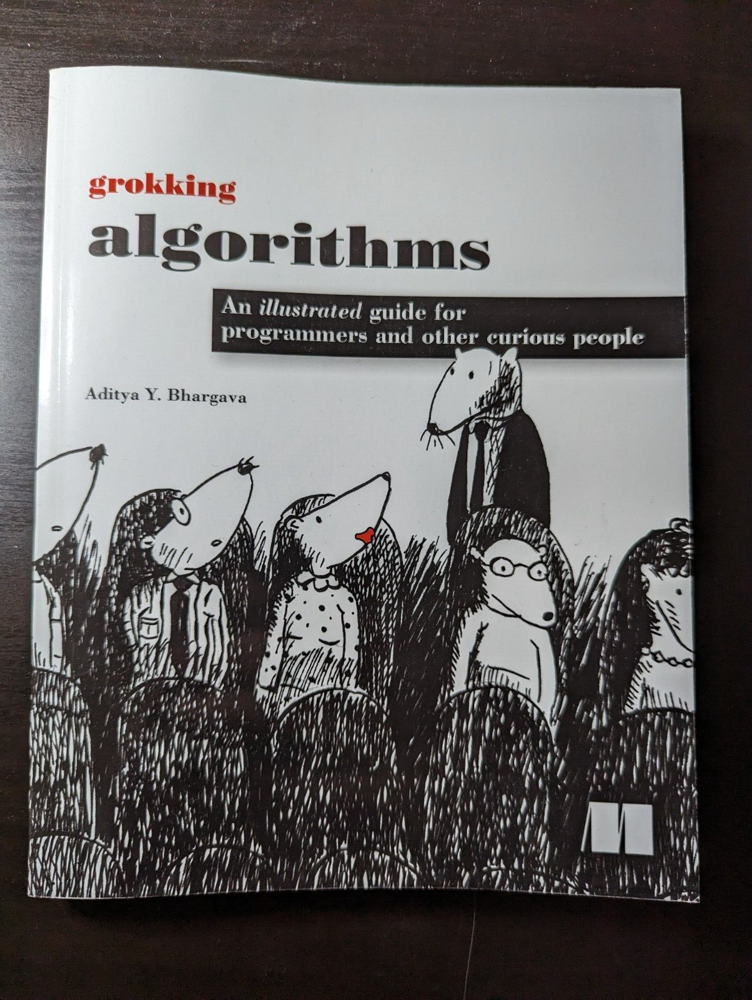
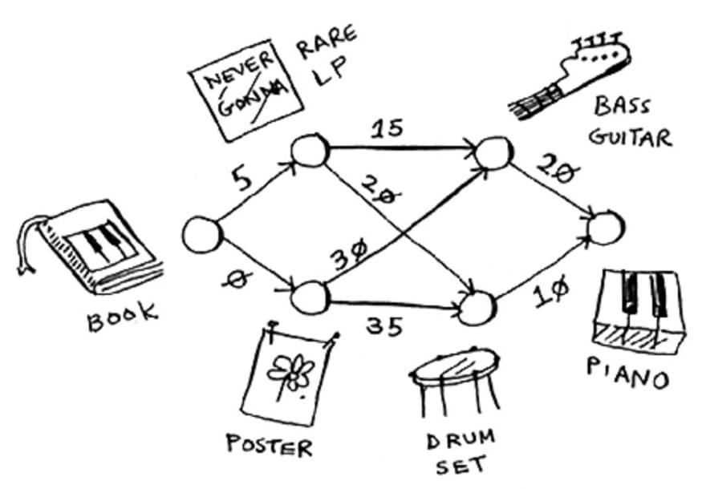

# Grokking algorithms

### by [Aditya Y. Bhargava](https://www.adit.io/)

This is not just another book on algorithms but one of the most interesting *books you will ever read on Algorithms and Data structure, particularly for beginners*.

---
## Table of contents 1/2

0. Preface
1. Introduction to Algorithms
2. Selection Sort
3. Recursion
4. Quicksort
5. Hash Tables

---
## Table of contents 2/2

6. Breadth-first Search
7. Dijkstra’s algorithm
8. Greedy algorithms
9. Dynamic programming
10. K-nearest neighbors
11. Where to go next

---
## Some excerpts

---
## Why it's useful ?

- *"Best Data Structure and Algorithms Book for Beginners"*
- explains in a simple and visual way, easy to understand language
- many such interesting and real-world examples
- short to read, chapters are bite-sized and self-contained
- even if you won't learn much new, you still could learn how to explain some of the more abstractish concepts in a very visual, simple and entertaining way.

---
# Thanks!

These slides are Open Source and live in a [github repository](https://github.com/ilmanzo/suse_presentations), feel free to improve them 💚

