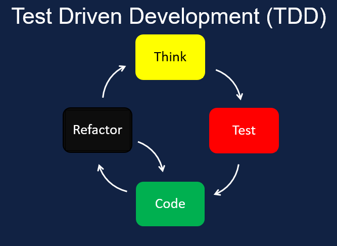

## Nim Containertools:

## My [HackWeek-22](https://hackweek.opensuse.org/22/projects/containerfile-slash-dockerfile-generator-library) project


---
## Project scope and purpose

- Practice with Nim advanced features like macros and metaprogramming
- Play with container technology
- Develop a POC that can be expanded for future cases
- Use TDD methodology to design and develop
- Have fun and try out something different

---
## the Nim programming language

# Efficient, expressive, elegant


[Nim](https://nim-lang.org/) is a statically typed compiled systems programming language.
- Intuitive and clean syntax, inspired from Python, Ada and Modula.
- Support for multiple operating systems
- Compiles to native binary or [Javascript](https://pietroppeter.github.io/p5nim/)
- Easy C, C++ and objC wrapping
- Decentralised package management
- trivia: openSUSE has *"first-class support"* for the Nim language [(phoronix)](https://www.phoronix.com/news/openSUSE-First-Class-Nim)

feel free to join `#discuss-nim` on slack 

---
## Test Driven Design/Development



1. Think of a feature
2. Write a failing test
3. Write enough code for passing the test
4. Refactor
5. Goto step 1

---
## Hello, ContainerTools

Container declarative syntax can be error prone and it's static. The library provide a DSL that enables a dynamic behaviour, while the Nim compiler ensure correctness.

```nim
import containertools
let image = container:
    FROM "opensuse/leap"
    CMD "echo Hello"

image.save "Containerfile"
image.build  
```

Library is published on official nimble package directory: https://nimble.directory/pkg/containertools

---
## a more complex example

```nim
import std/[strformat, times]
import containertools

for distro in ["leap","tumbleweed"]:
    let image = container:
        FROM "opensuse/" & distro
        if distro=="tumbleweed": # this a is Nim statement
          RUN "zypper -n install mypkg"
        CMD &"echo Hello from {distro} container built on {now()}"
    image.save "Containerfile." & distro
    image.build
```
we can also import an "existing" Containerfile and check it for errors, suggest optimizations and fix security issues

---
## How can useful for SUSE ?

- writing declarative YAML is getting more and more common (from Dockerfile to K8s to CI actions, to openQA schedules) but get tedious and error-prone
- having the support of a strong typed compiler and tools helps to increase flexibility and reduce human errors
- The tool can be reversed as a linter: import/parse an existing declarative definition (from customer ?) and give hints about possible optimizations or security issues


---

## Lessons taken

- having a good testsuite gives you freedom to a fearless refactor
- TDD lets you think from the users perspective
- Metaprogramming can be hard but is very powerful and expressive
- Choice of license is also important
- Examples and documentation are as important as a good working code

---
# Thank you!

Questions ?

