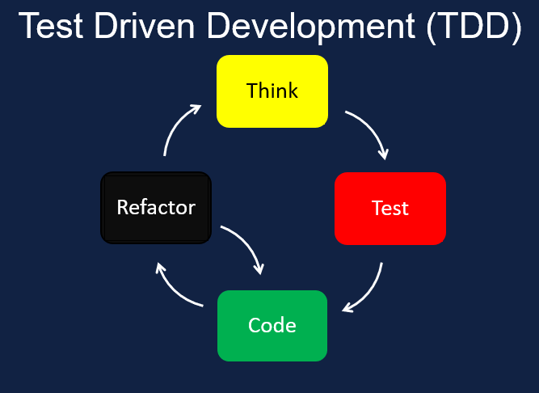

## Nim Containertools:

## My [HackWeek-22](https://hackweek.opensuse.org/22/projects/containerfile-slash-dockerfile-generator-library) project


---
## Project scope and purpose

- **Practice** with Nim's advanced features: **macros** and *metaprogramming*
- Play with **container** technology
- Develop a POC that can be expanded for future cases
- Use **Test Driven Development** methodology to design and develop code
- Have fun and try out something different
- **Publish** something on official nimble package directory: https://nimble.directory/pkg/containertools


---
## What's the Nim programming language ?

# Efficient, expressive, elegant

[Nim](https://nim-lang.org/) is a statically typed compiled systems programming language.
- Intuitive and clean syntax, inspired from Python, Ada and Modula.
- Support for multiple operating systems
- Compiles to native binary or [Javascript](https://pietroppeter.github.io/p5nim/)
- Easy C, C++ and objC wrapping
- Decentralised package management
- trivia: openSUSE has *"first-class support"* for the Nim language [(phoronix)](https://www.phoronix.com/news/openSUSE-First-Class-Nim)

Feel free to join `#discuss-nim` slack channel 

---
## A plain, old Containerfile

`Containerfile` is a plain text file with a simple syntax, composed of instructions that specifies how to create a container image.

```Docker
   FROM nginx
   COPY index.html /usr/share/nginx/html
   EXPOSE 8O8O
   CMD ["nginx", "-g", "daemon off;"]
```
While effective, it has some issues:
- no syntax checking until build/runtime (which usually happens in a CI)
- only static values, cannot have any logic or variable


---
## Hello, ContainerTools

`Containerfile` declarative syntax is static and can be error prone. The library provides a **DSL** (Domain Specific Language) that enables a dynamic behaviour, while the strict checking of the Nim compiler ensure correctness.

```nim
import containertools
let image = container:
    FROM "opensuse/leap"
    CMD "echo Hello"

image.save "Containerfile"
image.build  
```


---
### Static typechecking safety ...

```nim
import containertools
let image = container:
   FROM nginx
   COPY index.html /usr/share/nginx/html
   EXPOSE 8O8O
   CMD ["nginx", "-g", "daemon off;"]
image.save "Containerfile"
image.build  
```

*oops, we did an error. Can you spot it ?*

### ... ensured by the compiler / IDE tooling

```bash
$ nim compile
error.nim(5, 11) Error: invalid token. Expected a numeric value
```
---
### Easiness of declarative syntax ...

```nim
import std/[strformat, times]
import containertools

for distro in ["leap","tumbleweed"]:
    let image = container:
        FROM "opensuse/" & distro
        if distro=="tumbleweed": # this a is Nim statement
          RUN "zypper -n install mypkg"
        CMD &"echo Hello from {distro} container built on {now()}"
    image.save "Containerfile." & distro
    image.build
```
### ... with the power of a programming language 

we can also import an "existing" `Containerfile` and check it for errors, suggest optimizations and fix security issues

---
# How can it be useful for you @ SUSE ?

###  Writing declarative files (YAML?) is getting more and more common (`Dockerfiles`,`K8S` definitions, `CI actions`, `openQA schedules`) 

- As the size grows, they get tedious to maintain and error-prone
- Having the support of a strong typed compiler and tooling helps to increase flexibility, modularity and reduce human errors
- The library can also work as a **linter**: import/parse an existing declarative definition (provided from customer ?) and give hints about possible optimizations or security issues

---
#### Whole project was developed using TDD 



1. Think of a feature
2. Write a failing test
3. Write just enough code to pass the test
4. Refactor when needed
5. Goto step 1

---

## Lessons taken

- Having a good testsuite gives you freedom to a fearless refactor. During the design phase I used the growing test suite as a platform to try out new ideas
- TDD lets you think from the user's perspective
- Metaprogramming can be hard but is very powerful and expressive
- Good code is important, but examples and documentation are **fundamental** 
- Choice of OSS license is also important

---
# Thank you!

## Questions ?

These slides are available at https://github.com/ilmanzo/suse_presentations/
