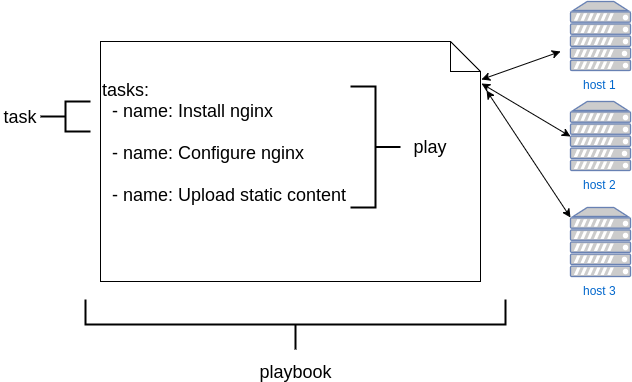

# introduction to Ansible

## 


---
# A little background

## Automation
is about taking manual processes and placing technology around them to make them repeatable.
Automation is the key to speed, consistency, scalability and repeatability.

Think about car factories in the 1900 vs automated robot industries

---
## Benefits of Automation:

What does automation enable:
- Scalability
- Reliability
- Repeatability
- Consistency
- Auditability
- Security

---
## Some widely-known configuration Management Tools

- [Salt](https://saltstack.com)
- [Puppet](https://puppetlabs.com)
- [Chef](https://www.chef.io)
- [Ansible](https://www.ansible.com)

---
## What is Ansible?

## Ansible is a tool for:
- Configuration Management
- Deploying software
- Orchestration
- Provisioning

---

##  Ansible features
- Based on Python
- Agentless (only needs Python on remote host)
- Only requires SSH
- Push based

---
# Idempotency

Configure systems using shell script can be simple and effective, but:
- complex logic to follow
- env variables scoping rules
- portability issues between distributions or operating system
- they are not repeatable (e.g. **idempotent**)

### With Ansible we solve this problem by writing the final destination state we want to reach; the tool makes only the necessary changes.


---
### Idempotency example #1
```yaml
# Ensure the user Adam exists in the system
    - name: Add the user 'Adam' with a specific uid and a primary group of 'sudo'
      ansible.builtin.user:
        name: adam
        comment: Adam Engineer
        uid: 1077
        group: sudo
        createhome: yes
        home: /home/users/adamlis    
```
vs 
```bash
$ adduser / useradd -b -u -d -G ... 
$ adduser / useradd -b -u -d -G ... 
ERROR: user 'adam' already exists
```

---
### Idempotency example #2
SAP HANA DEPLOYMENT EXTRACT ([source](https://people.redhat.com/mkoch/training/1805-farnborough/presentations/05%20-%20Ansible%20and%20Ansible%20Tower%20Introduction.pdf))

from
```bash
echo "vm.swappiness=60" >> /etc/sysctl.d/90-sap_hana.conf
echo "kernel.msgmni=32768" >> /etc/sysctl.d/90-sap_hana.conf
...
sysctl -p /etc/sysctl.d/90-sap_hana.conf
```
to

```yaml
- name: setting kernel tunables
  sysctl: name={{ item.name }} value={{ item.value }} state=present
          sysctl_set=yes reload=yes
  with_items:
    - { name: kernel.msgmni, value: 32768 }
    - { name: vm.swappiness, value: 60 }
 
```

---
## installing Ansible

we will use a development container for our workshop:

```
$ toolbox enter
```

When you have shell access to container, installation is simple:

```
# zypper install ansible
```
This need to be run only on the "main" node. Ansible by default works via ssh connection sending/pushing commands to other machines.

---
## Ansible Hello World

```bash
$ ansible -m ping localhost
localhost | SUCCESS => {
    "changed": false,
    "ping": "pong"
}
```

this means that Ansible is correctly installed and working. `-m` stands for "use this module" 

---
# Ansible Basic Terminology

- **Task** : An action to perform
- **Play** : a collection of tasks
- **Playbook** : YAML file containing one or more plays



---
PLAYBOOK EXAMPLE: INSTALL & CONFIGURE APACHE WEBSERVER

```yaml
# begin of playbook
--- 
- name: play to install and start apache
  hosts: localhost
  connection: local
  become: yes
  tasks:
    - name: install apache2 (task1)
      zypper: name=apache2 state=latest
    - name: start apache2 (task2)
      systemd:
        state: started
        name: apache2
- name: Include a play after another play
  ansible.builtin.import_playbook: otherplays.yaml        
# end of playbook
```

---
# More Terminology

- **Module** : Blob of Python code which is executed to perform task 
- **Inventory**: File containing hosts and groups of hosts to run tasks
- **Role**: A mechanism for reusing and organizing code in Ansible in a standard  hierarchy
- **Facts**: Builtin variables related to remote systems (i.e. ipaddress, hostname, cpu, ram, disk, etc.). They are filled-in by the `setup` module which is always run by default. Let's see the facts in our machine: 

```
$ ansible localhost -m setup | less
```

---
# running Ansible

There are two ways to run ansible:

1. ad hoc

  Run a single task

  `ansible <pattern> [options]`

2. Playbook

Run multiple tasks (a *playbook*) sequentially

  `ansible-playbook <pattern> [options]`

---
# Inventory

Ansible inventory is the list of hosts where we want to apply our recipe. 
The simplest inventory is a single file with a list of hosts and groups. The default location for this file is `/etc/ansible/hosts`. You can specify a different inventory file at the command line using the `-i <path>` option or in configuration using inventory.

A inventory can contain many groups of hosts and associate variables to the group or at the host level.

The inventory can be made dynamic, user can provide a script that outputs list of machines (there are some already made for most cloud providers)

---
INVENTORY EXAMPLE with GROUP VARS

```ini
[asia]
openqa-worker1.example.suse.asia
srv0[1-5].example.suse.asia

[europe]
machine-debug.example.suse.de
baremetal[1-2].example.suse.de
another_server-1.example.suse.de

[asia:vars]
ntp_server=time-sync-server.example.suse.com 
nfs_path="another-nfs-server.suse.asia:/folder/blabla/pckgs"

[europe:vars]
ntp_server=ntp.suse.de 
nfs_path="11.22.33.44:/folder nfs-server.suse.de:/mnt/myfolder"

```
---
## How Ansible talks to hosts ?


---
# Handlers

Sometimes you want a task to run only when a change is made on a machine. For example, you may want to restart a service if a task updates the configuration of that service, but not if the configuration is unchanged. Ansible uses handlers to address this use case. Handlers are tasks that only run when notified.

[See documentation example](https://docs.ansible.com/ansible/latest/playbook_guide/playbooks_handlers.html)

---
# Register variables


---
# Conditionals

A task can be conditionally executed with the `when:` keyword. 

```yaml
tasks:
  - name: Shut down CentOS 6 and Debian 7 systems
    ansible.builtin.command: /sbin/shutdown -t now
    when: (ansible_facts['distribution'] == "CentOS" and ansible_facts['distribution_major_version'] == "6") or
          (ansible_facts['distribution'] == "Debian" and ansible_facts['distribution_major_version'] == "7")
```

[see more example on the documentation](https://docs.ansible.com/ansible/latest/playbook_guide/playbooks_conditionals.html)

---
# Iteration


--- 
# Facts


---
# Ansible galaxy

---
# Ansible vault


---
# Thanks!

These slides are Open Source and live in a [github repository](https://github.com/ilmanzo/suse_presentations), feel free to improve them 💚

