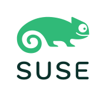
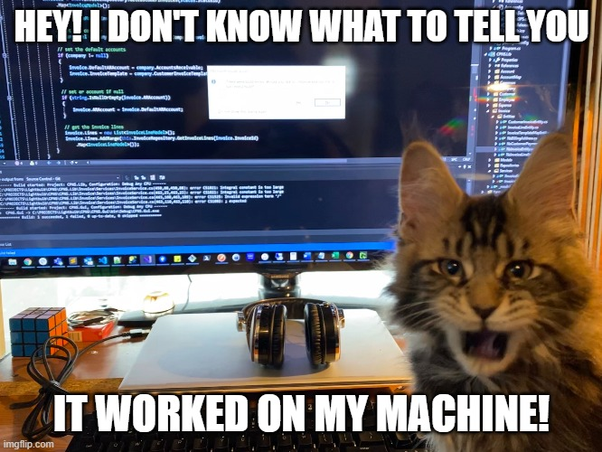

# 🛡️ SELinux the Easy Way
### A Practical Guide for QA Engineers

### Andrea Manzini
#### Software Quality Engineer @ SUSE

May 2026



---

# 📋 Agenda

1. SELinux Basics and QA Context
2. Modes: Enforcing, Permissive, Disabled
3. Access Decisions: DAC + MAC
4. Policies and Rule Anatomy
5. Labels: Understand, Inspect, Fix
6. Booleans, Ports, and File Contexts
7. QA Testing Guidelines
8. Troubleshooting Denials
9. On RKE2 and Storage providers
10. Live Demos (if time permits)
11. QA Cheat Sheet

---

## 🤔 What's SELinux?

**[SELinux](https://github.com/SELinuxProject)** (Security-Enhanced Linux) is a security architecture for Linux systems that provides Mandatory Access Control (MAC). 

* **MAC vs. DAC:** Unlike traditional Linux permissions (Discretionary Access Control) where users control their files, MAC enforces policies set by the administrator.
* **Default Deny:** If there isn't an explicit rule allowing an action, it is blocked.
* Originally developed by the NSA, now integrated into the mainline Linux kernel.
* Implemented via Linux Security Modules (LSM).

---

# 🛡️ Why SELinux?

* **Containment:** If a service (like a web server) is compromised, SELinux prevents the attacker from accessing the rest of the system or other services.
* **Privilege Escalation Prevention:** Even an exploit running as `root` can be contained if SELinux policies restrict what that specific `root` process can do.
* **Zero-Day Protection:** Helps mitigate the impact of unknown vulnerabilities by enforcing strict behavioral boundaries.
* **Compliance:** Often required by security standards and enterprise environments.

---
# 🎯 Why QA Cares About SELinux


* SELinux is the **default MAC** on SLES 16, Leap 16, and Tumbleweed
* Customers run SELinux in **Enforcing** mode — so must QA
* SELinux denials look like permission errors — easy to misdiagnose
* A proper bug report with SELinux context saves developers **hours**

---
# Happens every time



> "It works on my machine" — because you had SELinux disabled.

---
# 🔀 SELinux Modes


| Mode | Behavior | When to use |
|------|----------|-------------|
| **Enforcing** | Blocks + logs denials | Always (production & testing) |
| **Permissive** | Logs but does NOT block | Diagnosing SELinux issues only |
| **Disabled** | SELinux not initialized | Never (requires reboot + full relabel to re-enable) |

---

```bash
$ sestatus
```

```bash
$ getenforce                    # Check current mode
Enforcing

$ sudo setenforce 0             # Switch to Permissive (temporary)
$ sudo setenforce 1             # Back to Enforcing

# Permanent: edit /etc/selinux/config and reboot
SELINUX=enforcing
```


---
### ⚙️ [How SELinux Works](https://docs.rockylinux.org/9/guides/security/learning_selinux/) (see link for picture)

SELinux acts as a gatekeeper between a **Subject** (usually a process) and an **Object** (a file, directory, port, etc.).

1. **Subject Request:** A process requests an action (e.g., `read`) on an object (e.g., a file).
2. **DAC Check:** Standard Linux permissions (Owner/Group/Others) are checked first. If this fails, access is denied immediately.

but there's more ...

---
### ⚙️ [How SELinux Works](https://docs.rockylinux.org/9/guides/security/learning_selinux/) 


3. **MAC Check:** If DAC passes, SELinux steps in. It looks at the **scontext** (source context — the process) and the **tcontext** (target context — the file).
4. **Policy Evaluation:** The SELinux policy is consulted to see if there is an explicit rule allowing the scontext to perform the requested action on the tcontext.
5. **Decision:** Allowed if a rule exists, blocked otherwise (Default Deny).

see also [This quick intro](https://wiki.gentoo.org/wiki/SELinux/Quick_introduction)

---

## 📖 Policies: The Rulebook

A **policy** is the set of rules that defines what each domain (process type) is allowed to do.

**Policy types** (set in `/etc/selinux/config`):

| Policy | Description | Use case |
|--------|------------|----------|
| **targeted** | Only known services are confined, everything else runs unconfined | Default on SLES 16 / Tumbleweed / Leap 16 |
| **minimum** | Like targeted but fewer services confined | Minimal environments (not shipped on SUSE) |
| **mls** | Full Multi-Level Security | Government/military only |

---
**Policies are modular** — built from independent `.pp` modules:

```bash
# List loaded policy modules
$ sudo semodule -l | head
abrt
account-utils
accountsd
acct
afs

# Install a custom module
$ sudo semodule -i my_fix.pp

# Remove a module
$ sudo semodule -r my_fix
```

SLES 16 ships **440+ policy modules** out of the box (based on Fedora upstream policy with SUSE-specific patches). Custom modules are how you extend the policy. `audit2allow -M` generates them.

---
```bash
  # See specific module source (if selinux-policy-devel installed)
  sudo zypper install selinux-policy-devel
  ls /usr/share/selinux/devel/

  # Extract a loaded module to CIL (text) format
  sudo semodule -E ftpd            # writes ftpd.cil in cwd
  sedismod ftpd.pp                 # disassemble .pp binary policy

  # Or use sesearch to query rules directly
  sudo zypper install setools-console
  sesearch --allow -s ftpd_t          # all allow rules for ftpd
  sesearch --allow -t etc_t           # all rules targeting etc_t
```

---
# 🧩 Policy Rules: A Concrete Example

A Type Enforcement (TE) rule looks like this:

```
allow  httpd_t  httpd_sys_content_t : file  { read getattr open };
─────  ───────  ──────────────────   ────   ──────────────────────
  │     source       target          class      permissions
  │     domain       type
  │
  └─ "allow this to happen"
```

**Read it as**: "A process running in the `httpd_t` domain is allowed to `read`, `getattr`, and `open` files labeled `httpd_sys_content_t`."

---
# 🧩 Policy Rules: A Concrete Example
You can query existing rules with `sesearch`:

```bash
# What can httpd_t read?
$ sesearch --allow -s httpd_t -t httpd_sys_content_t -c file
allow httpd_t httpd_sys_content_t:file { getattr ioctl lock map open read };

# What can write to files labeled httpd_log_t?
$ sesearch --allow -t httpd_log_t -c file -p write
allow httpd_t httpd_log_t:file { append create write ... };
```

If no rule exists → **denied**. That's the "default deny" principle.

---
# 📂 Where Do Policies Live? (on SUSE)

```
/etc/selinux/
├── config                      # SELINUX=enforcing, SELINUXTYPE=targeted
└── targeted/
    ├── policy/policy.33        # compiled binary policy (loaded by kernel)
    ├── contexts/               # default contexts for logins, services, etc.
    └── modules/                # installed policy modules (recently migrated here)

/usr/share/selinux/targeted/    # source .pp modules shipped by packages
```
---
**Key packages** (zypper):

| Package | Contents |
|---------|----------|
| `selinux-policy` | Base policy, file contexts, core types |
| `selinux-policy-targeted` | The targeted policy variant (440+ modules) |
| `container-selinux` | Policy for Podman/Docker containers |
| `policycoreutils-python-utils` | `semanage`, `audit2allow`, `audit2why` |

**SUSE-specific**: policy modules recently migrated from `/var/lib/selinux` to `/etc/selinux` so they're covered by BTRFS snapshots and rollbacks.

---

# 🏷️ What is a Label?

Every object in the system has a **security context** (label).

A label is made of 4 parts: user, role, type, level

```
system_u : system_r : httpd_t : s0:c1,c2
  user       role       type      level
```

---
## 🔍 Label Fields Explained : User

**User** (`system_u`, `unconfined_u`, `staff_u`)
* Used by **RBAC (Role-Based Access Control)** policies.
* [Maps Linux users to SELinux users](https://wiki.gentoo.org/wiki/SELinux/Users_and_logins). Controls which roles are available to a user.
* `system_u` = system daemons, `unconfined_u` = regular users (no restrictions)

---
## 🔍 Label Fields Explained : Role

**Role** (`system_r`, `object_r`, `unconfined_r`)
* Also used by **RBAC**.
* Bridges users to types — dictates which domains (types) a user can transition into.
* `system_r` = system processes, `object_r` = files/passive objects

---
## 🔍 Label Fields Explained: Type

**Type** (`httpd_t`, `user_home_t`, `tmp_t`)
* Used by **TE (Type Enforcement)** policies.
* **The field you'll work with 95% of the time.** In "targeted" policy, almost all rules check this.
* Processes have a **domain** (`httpd_t`), files have a **type** (`httpd_sys_content_t`).
* Rule format: `allow <domain> <type> : <class> { <permissions> };`

---
## 🔍 Label Fields Explained: Level

**Level** (`s0`, `s0:c1,c2`)
* Used by **MLS/MCS (Multi-Level / Multi-Category Security)** policies.
* Defines sensitivity and categories. Crucial for **Container isolation** (e.g., Podman gives each container a unique category like `c1,c2`).

---

# 👀 Viewing Labels

```bash
# Files
$ ls -Z /var/www/html/index.html
system_u:object_r:httpd_sys_content_t:s0 /var/www/html/index.html

# Processes
$ ps -eZ | grep nginx
system_u:system_r:httpd_t:s0     1234 ?  00:00:00 nginx

# Your own context
$ id -Z
unconfined_u:unconfined_r:unconfined_t:s0-s0:c0.c1023
```

**Rule**: if a process in domain `X_t` tries to access a file of type `Y_t`, SELinux checks the policy for an `allow X_t Y_t` rule.

---

# ✏️ Changing Labels

| Tool | Permanent? | Use case |
|------|-----------|----------|
| `chcon -t httpd_sys_content_t file` | No (lost on relabel) | Quick testing |
| `semanage fcontext -a -t httpd_sys_content_t '/srv/web(/.*)?'` + `restorecon -Rv /srv/web` | Yes | Production fix |

**QA tip**: always use `semanage fcontext` + `restorecon` in test procedures. `chcon` changes silently vanish after `restorecon -R` or a full relabel.

---
#### ⚠️ The mv/cp Trap

```bash
# when a script creates a test config in temp directory
$ echo "server {}" > /tmp/mysite.conf
$ ls -Z /tmp/mysite.conf
unconfined_u:object_r:user_tmp_t:s0  /tmp/mysite.conf
```


---
#### ⚠️ The mv/cp Trap
**COPY** creates a new file inode → file will be labeled by context rules

```
$ cp /tmp/mysite.conf /etc/nginx/conf.d/
$ ls -Z /etc/nginx/conf.d/mysite.conf
unconfined_u:object_r:httpd_config_t:s0     # correct!
```

 *MOVE* keeps original label
```
$ mv /tmp/mysite.conf /etc/nginx/conf.d/
$ ls -Z /etc/nginx/conf.d/mysite.conf
unconfined_u:object_r:user_tmp_t:s0         # WRONG! nginx can't read this
```


**Fix**: `restorecon -v /etc/nginx/conf.d/mysite.conf`

---

# 🐛 QA Angle: Labels in Bug Reports

When filing a bug where SELinux might be involved, **always include**:

```bash
# 1. Label of the file/directory that failed
ls -Z /path/to/file

# 2. Label of the process that got denied
ps -eZ | grep <process_name>

# 3. What label the file SHOULD have
restorecon -n -v /path/to/file

# 4. Current SELinux mode
getenforce
```

A bug report that says "permission denied" without this info is **incomplete**.

---

# 🔘 Booleans: Policy Switches

Modify policy *behavior* **without writing custom rules**.

```bash
# List all booleans related to httpd
$ getsebool -a | grep httpd
httpd_can_network_connect --> off
httpd_can_sendmail --> off
httpd_enable_homedirs --> off

# Allow Apache to make network connections
$ sudo setsebool -P httpd_can_network_connect on
```

The **`-P`** flag = persistent across reboots. Without it, the change is lost on restart.

---

# 🔌 Port Labeling

SELinux controls which processes can **bind** to which ports.

```bash
# See what ports SSH is allowed to use
$ sudo semanage port -l | grep ssh
ssh_port_t                     tcp      22

# Move SSH to port 2222 → it will FAIL to start
# Fix: add the port to the policy
$ sudo semanage port -a -t ssh_port_t -p tcp 2222

# Verify
$ sudo semanage port -l | grep ssh
ssh_port_t                     tcp      2222, 22
```

Same applies to any service using a non-standard port.

---

# 📁 File Context Rules

The **permanent** way to manage labels for custom paths:

```bash
# Tell SELinux: everything under /srv/myapp is web content
$ sudo semanage fcontext -a -t httpd_sys_content_t '/srv/myapp(/.*)?'

# Apply the rule to existing files
$ sudo restorecon -Rv /srv/myapp
Relabeled /srv/myapp from unconfined_u:object_r:default_t:s0
  to unconfined_u:object_r:httpd_sys_content_t:s0

# Verify
$ ls -Z /srv/myapp/
system_u:object_r:httpd_sys_content_t:s0 index.html
```

---

# ✅ QA Angle: Testing with SELinux

**Rules for QA test environments:**

1. **Always test in Enforcing mode** — matches customer environments
2. Use Permissive **only** to diagnose, then switch back immediately
3. Never put `setenforce 0` in test setup scripts
4. After installing/upgrading a package, run `restorecon -R` on its paths
5. If a test fails with "Permission denied", check SELinux **before** filing a DAC bug

---

# 🔎 Where to Look for Denials

```bash
# The audit log (primary source)
$ sudo ausearch -m AVC -ts recent

# Or directly
$ sudo grep "avc:  denied" /var/log/audit/audit.log

# Via journald
$ sudo journalctl -t audit --since "10 minutes ago" | grep AVC
```

**No denials showing?** Check:
- Is `auditd` running? (`systemctl status auditd`)
- Is SELinux actually in Enforcing? (`getenforce`)
- Some denials are "dontaudit" — use `semodule -DB` to disable dontaudit rules and rebuild policy (re-enable with `semodule -B`)

---
### 🔬 Anatomy of a Denial

```
type=AVC msg=audit(1716000000.123:456): avc:  denied  { read }
  for  pid=1234 comm="nginx" name="mysite.conf"
  dev="sda1" ino=5678
  scontext=system_u:system_r:httpd_t:s0
  tcontext=unconfined_u:object_r:user_tmp_t:s0
  tclass=file permissive=0
```

| Field | Meaning |
|-------|---------|
| `{ read }` | Which action was denied |
| `comm="nginx"` | Which program tried |
| `scontext=...httpd_t...` | Process domain (subject) |
| `tcontext=...user_tmp_t...` | File type (target) |
| `tclass=file` | Object class |

**Read it as**: "nginx (`httpd_t`) tried to read a file labeled `user_tmp_t` → denied"

---
## ⚡ Quick Check: is it a SELinux issue?

```bash
# Step 1: Something fails. Is SELinux blocking it?
$ sudo setenforce 0          # Permissive mode

# Step 2: Retry the operation
$ sudo systemctl restart nginx
# If it works now → SELinux was blocking it

# Step 3: IMMEDIATELY switch back
$ sudo setenforce 1

# Step 4: Find the denial
$ sudo ausearch -m AVC -ts recent
```

**Never leave a system in Permissive mode** after testing. Automate: set a timer or use `at` to switch back.

---

# 🔧 audit2why & audit2allow

```bash
# WHY was it denied?
$ sudo ausearch -m AVC -ts recent | audit2why
Was caused by: Missing type enforcement (TE) allow rule.
  Allow rules: allow httpd_t user_tmp_t:file read;

# WHAT rule would fix it?
$ sudo ausearch -m AVC -ts recent | audit2allow
#============= httpd_t ==============
allow httpd_t user_tmp_t:file read;

# Generate a loadable policy module
$ sudo ausearch -m AVC -ts recent | audit2allow -M my_nginx_fix
$ sudo semodule -i my_nginx_fix.pp
```

**Warning**: `audit2allow` may suggest overly broad rules. Always check what it proposes before loading.

---

# 🚨 setroubleshoot / sealert

Human-readable analysis of denials:

```bash
$ sudo sealert -a /var/log/audit/audit.log

SELinux is preventing nginx from read access on the file mysite.conf.

*****  Plugin restorecon (99.5 confidence) suggests   **************
If you want to fix the label:
  restorecon -v /etc/nginx/conf.d/mysite.conf

*****  Plugin catchall (1.49 confidence) suggests   *****************
If you want to allow httpd_t to read user_tmp_t files:
  audit2allow -M mypol
```

`sealert` ranks suggestions by confidence — **start from the top**.
---

# 🐳 SELinux & Container Storage (RKE2)

**[RKE2](https://docs.rke2.io/)** (Rancher Kubernetes Engine 2) requires SELinux configuration for storage backends and persistent volumes.

**Key packages**:
* `rke2-selinux` — custom policy for RKE2 components (auto-installed on RPM systems)
* `container-selinux` — base container runtime policy

**Enable in config**:
```yaml
# /etc/rancher/rke2/config.yaml
selinux: true
```

**⚠️ Reboot required** after installing SELinux packages before starting RKE2.

---

# 🐳 Container Volume Isolation (MCS)

SELinux uses **MCS** (Multi-Category Security) to isolate containers.

* Each container gets unique category pair: `s0:c123,c456`
* Prevents containers from accessing each other's volumes
* Even if running as same UID

**Example Pod security context**:
```yaml
spec:
  securityContext:
    seLinuxOptions:
      level: "s0:c0.c1023"  # allow broad category range
```

**Kubernetes 1.27+**: Efficient mount-time labeling — no recursive `chcon` on large volumes.
See [K8s efficient relabeling blog](https://kubernetes.io/blog/2023/04/18/kubernetes-1-27-efficient-selinux-relabeling-beta/).

---

# 🔧 Storage Backend Issues & Fixes

| Backend | Issue | Fix |
|---------|-------|-----|
| **Longhorn** | iSCSI `dac_override` denials (container-selinux v2.189.0+) | Load custom module: `echo '(allow iscsid_t self (capability (dac_override)))' > fix.cil && semodule -vi fix.cil` [KB](https://longhorn.io/kb/troubleshooting-volume-attachment-fails-due-to-selinux-denials/) |
| **local-path-provisioner** | SELinux blocks hostPath access | `chcon -t container_file_t -R /opt/local-path-provisioner` [Issue](https://github.com/rancher/local-path-provisioner/issues/362) |
| **NFS volumes** | Container can't mount NFS | `setsebool -P virt_use_nfs on` |

---

# 📚 RKE2 + SELinux References

**Official docs**:
* [RKE2 SELinux Documentation](https://docs.rke2.io/security/selinux)
* [SUSE RKE2 SELinux Guide](https://documentation.suse.com/cloudnative/rke2/latest/en/security/selinux.html)
* [Kubernetes Security Contexts](https://kubernetes.io/docs/tasks/configure-pod-container/security-context/)

**Known issues**:
* [RKE2 Known Issues](https://docs.rke2.io/known_issues) — SELinux module upgrade problems
* [Downstream cluster SELinux setup](https://github.com/rancher/rancher/issues/48551)

**QA testing notes**:
* Always test with `selinux: true` in RKE2 config
* Check volume mount denials: `ausearch -m AVC | grep mount`
* Verify PV contexts: `ls -Z /var/lib/kubelet/pods/*/volumes/`


---
# 🧪 Demo Setup

**Prerequisites**: openSUSE Tumbleweed with `podman` installed.

```bash
# From this repo's directory:
$ ./selinux-lab.sh

# This will:
# 1. Create a Tumbleweed distrobox named "selinux-lab"
# 2. Install SELinux tools, nginx, audit utilities
# 3. Copy a sample audit log for offline demos

# Enter the lab:
$ podman start -ai selinux-lab
```

All demo commands in the following slides can be run inside this container.
Note: actual enforcement requires a system with SELinux enabled in the kernel (Tumbleweed, SLES 16).

---

# 💥 Demo: nginx Can't Read Its Config

```bash
# 1. Create a config file in /tmp
echo 'server { listen 8080; root /usr/share/nginx/html; }' \
  > /tmp/demo.conf

# 2. Move it (not copy!) to nginx config dir
mv /tmp/demo.conf /etc/nginx/conf.d/

# 3. Check the label — it's WRONG
ls -Z /etc/nginx/conf.d/demo.conf
# → user_tmp_t (should be httpd_config_t)

# 4. On a real enforcing system: nginx would fail to start
#    Check the audit log for the AVC denial

# 5. Fix it
sudo restorecon -v /etc/nginx/conf.d/demo.conf
# → Relabeled to httpd_config_t

# 6. Verify
ls -Z /etc/nginx/conf.d/demo.conf
```

---

# 🚪 Demo: Service on a Non-standard Port

```bash
# 1. Check which ports httpd_t can bind to
sudo semanage port -l | grep http_port
# → http_port_t    tcp    80, 81, 443, 488, ...

# 2. Try to use port 8888 → SELinux would block it
#    The AVC denial would show:
#    denied { name_bind } for ... scontext=...httpd_t...

# 3. Add port 8888 to the allowed list
sudo semanage port -a -t http_port_t -p tcp 8888

# 4. Verify
sudo semanage port -l | grep http_port
# → http_port_t    tcp    8888, 80, 81, 443, ...

# 5. Now the service can bind to port 8888
```

---

### 📋 QA Cheat Sheet

| Task | Command |
|------|---------|
| Check SELinux mode | `getenforce` |
| View file labels | `ls -Z /path/to/file` |
| View process labels | `ps -eZ \| grep <name>` |
| Find recent denials | `ausearch -m AVC -ts recent` |
| Explain a denial | `ausearch -m AVC -ts recent \| audit2why` |
| Fix a wrong label | `restorecon -v /path/to/file` |
| Check expected label | `restorecon -n -v /path/to/file` |
| Add permanent label rule | `semanage fcontext -a -t <type> '/path(/.*)?'` |
| Toggle boolean | `setsebool -P <bool> on` |
| Quick SELinux test | `setenforce 0` → test → `setenforce 1` |

---
<!-- _backgroundImage: linear-gradient(to bottom right, #171c26, #171c26) -->

# 🙏 Thank You!

**Questions?**

Andrea Manzini

Software Quality Engineer @ SUSE

Lab setup & slides:
https://github.com/ilmanzo/suse_presentations


